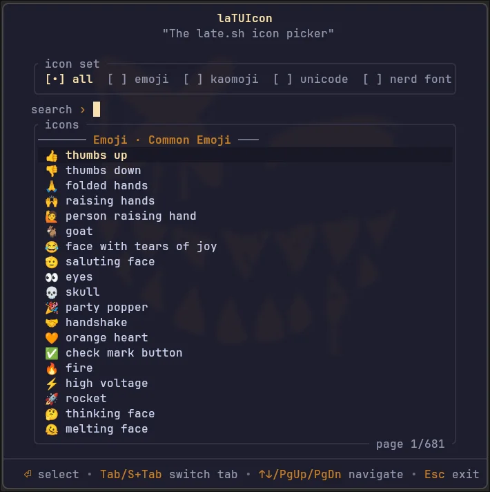

# 😴 latuicon

`latuicon`, the **lat**e **TUI** **icon** picker: a rip-off of the [late.sh](https://github.com/mpiorowski/late-sh) embedded icon picker.

<p align="center">
    
</p>

<p align="center">
    <a href="https://crates.io/crates/latuicon"></a>
    <a href="LICENSE"></a>
    
    <a href="https://github.com/coko7/latuicon/actions/workflows/rust.yml"></a>
</p>

A terminal UI icon picker for emoji, kaomoji, Unicode characters, and [Nerd Font](https://www.nerdfonts.com/) glyphs. Press Enter to print the selected icon to stdout; press Esc to exit without output.

> [!TIP]
> Want to use `latuicon` in Neovim? Check out the [`latuicon.nvim`](https://github.com/coko7/latuicon.nvim) wrapper plugin!

## Table of Contents

- [Install](#install)
  - [Nix](#nix)
  - [Cargo](#cargo)
  - [Arch Linux (AUR)](#arch-linux-aur)
  - [Build from source](#build-from-source)
  - [Nix development environment](#nix-development-environment)
- [Usage](#usage)
  - [Keybindings](#keybindings)
  - [Tabs](#tabs)
  - [Desktop integration example (Hyprland)](#desktop-integration-example-hyprland)
- [Configuration](#configuration)
  - [Themes](#themes)
  - [Search mode](#search-mode)
  - [Tabs](#tabs-1)
- [What's the relationship with late.sh?](#whats-the-relationship-with-latesh)

## Install

### Nix

Run without installing:

```sh
nix run github:coko7/latuicon
```

Or install it into your Nix profile:

```sh
nix profile add github:coko7/latuicon
```

### Cargo

Install the [`latuicon`](https://crates.io/crates/latuicon) bin crate:

```sh
cargo install latuicon
```

### Arch Linux (AUR)

Install the [`latuicon`](https://aur.archlinux.org/packages/latuicon) AUR package:

```sh
$ yay -S latuicon
# or
$ paru -S latuicon
```

### Build from source

```sh
./scripts/deploy.sh
```

Builds a release binary and installs it to `~/.local/bin/latuicon`.

### Nix development environment

The flake also provides the Rust toolchain, Clippy, rustfmt, and rust-analyzer for
contributors:

```sh
nix develop
nix flake check
```

## Usage

```sh
latuicon                          # default theme, opens on emoji tab
latuicon --theme mocha            # specific theme
LATUICON_THEME=dracula latuicon

latuicon --tab unicode            # sets default tab (all, emoji, kaomoji, unicode, nerd font)
LATUICON_TAB=nerd latuicon

latuicon --search-mode simple     # substring-only search (default: fuzzy)
LATUICON_SEARCH=fuzzy latuicon

latuicon --tabs "nerd-font,emoji,all,kaomoji,unicode"  # reorder tab strip / Tab cycling
LATUICON_TABS="nerd-font,emoji,all,kaomoji,unicode" latuicon

latuicon --tabs "emoji,kaomoji"  # only enable emoji and kaomoji tabs
```

Prints the chosen icon to `stdout`.

### Keybindings

| Key | Action |
| ----- | -------- |
| `↑` / `↓` | Navigate list |
| `Ctrl+K` / `Ctrl+J` | Navigate list (vi-style) |
| `PgUp` / `PgDn` | Page up / down |
| `Ctrl+U` / `Ctrl+D` | Half-page up / down |
| `Tab` / `Shift+Tab` | Switch tab |
| `Enter` | Select and exit |
| `Esc` / `Ctrl+C` | Exit without selecting |
| Type anything | Filter by name |
| `Ctrl+Z` | Undo search edit |
| Mouse click | Select tab or item |
| Double-click | Select and exit |
| Scroll wheel | Scroll list |

Search supports full emacs cursor movement (`Ctrl+A`, `Ctrl+E`, `Ctrl+F`, `Ctrl+B`, `Ctrl+W`, `Ctrl+Y`, etc.).

### Tabs

- **All** — every icon from every other tab, combined into one searchable set
- **Emoji** — common emoji + full emoji set
- **Kaomoji** — curated kaomoji collection
- **Unicode** — common symbols + Box Drawing, Geometric Shapes, Arrows, Math Operators, Dingbats; search supports `U+XXXX` / `0xXXXX` hex lookup and full Unicode name scan
- **Nerd Font** — common glyphs + full Nerd Font glyph set

### Desktop integration example ([Hyprland](https://hypr.land/))

In my setup, I use [`floatty.sh`](https://github.com/coko7/scripts/blob/main/global/floatty.sh) to open `latuicon` in a floating terminal window and pipe the result to the clipboard. Here is my custom Hyprland binding for it:

```ini
bindd = $mainMod, comma, laTUIcon icon picker, exec, FLOATTY_CAPTURE_OUTPUT=1 bash floatty.sh latuicon latuicon | wl-copy
```

And these are the Hyprland window rules for it:

```ini
# Special rules for floating/prompt terminals
windowrule {
    name = floater-kitty
    match:class = ^(floater-kitty-.*)$
    no_anim = on
    float = on
    center = on
    size = 1000 800
}

windowrule {
  name = floater-kitty-latuicon
  match:class = floater-kitty-latuicon
  size = 700 700
}
```

Pressing `$mainMod + ,` opens a floating terminal with the picker; confirming an icon copies it straight to the Wayland clipboard.

## Configuration

You can configure `latuicon` in `config.toml`:

- Linux: `~/.config/latuicon/config.toml`
- macOS: `~/Library/Application Support/latuicon/config.toml`
- Windows: `%APPDATA%\latuicon\config.toml`

Example:

```toml
# Set the color theme
theme = "mocha"

# Set the default tab (selected tab on launch)
default_tab = "all"

# Set the search mode:
# - simple: case-insensitive substring match only
# - fuzzy: substring match, using word-level Levenshtein distance for ignoring small typos
search_mode = "fuzzy" # or 'simple'

# Configure the enabled tabs and their display order.
# Missing tabs will not have their icons available through "All".
tabs = ["all", "emoji", "kaomoji", "unicode", "nerd-font"] 
```

Override the path with `--config <path>` / `-c <path>` / `LATUICON_CONFIG`.
Precedence: CLI flag > env var > config file > built-in default.

### Themes

`contrast` (default), `late`, `purple`, `mocha`, `gruvbox`, `dracula`

### Search mode

- `fuzzy` (default) — substring match, falling back to word-level Levenshtein distance so small typos still find the right icon
- `simple` — case-insensitive substring match only

Set with `--search-mode <mode>` / `-s <mode>` / `LATUICON_SEARCH` / `search_mode` in the config file.

### Tabs

You can configure which tabs are enabled, and in what order.
To do so, provide a list which corresponds to a subset of the 5 tabs.
A tab missing from this subset will be disabled: hidden from UI and excluded from the "All" icon set.

Set with `--tabs <list>` / `LATUICON_TABS` / `tabs` in the config file.

## What's the relationship with late.sh?

The project was seeded from the icon-picker component of [late.sh](https://github.com/mpiorowski/late-sh) at commit [6c670683](https://github.com/mpiorowski/late-sh/commit/6c670683e301cbef3df08683c84bc91141a0faee). Code written after the initial commit is not derived from that project.

The original icon picker was written by [@mevanlc](https://github.com/mevanlc); the late.sh project is maintained by [@mpiorowski](https://github.com/mpiorowski).

**A big thanks to the both of them! ✨**

> [!NOTE]
> For more details, you can read the full story of how `latuicon` began on my blog: [blog.lazyfreax.dev/blog/latuicon-icon-picker](https://blog.lazyfreax.dev/blog/latuicon-icon-picker)

See [`THIRD_PARTY_LICENSES.md`](./THIRD_PARTY_LICENSES.md) for the license covering the derived code from the initial commit.
